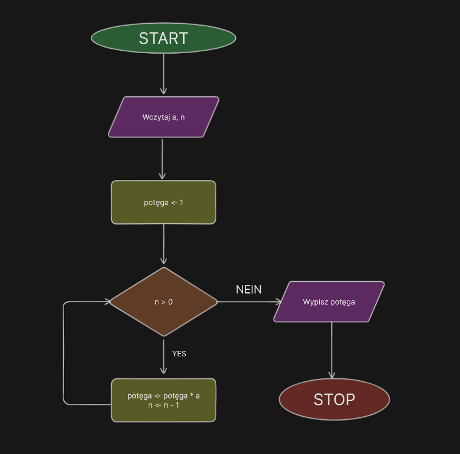

<style>
section.center > * {
  text-align: center;
}
</style>

<!-- _class: center -->

# Algorytm Szybkiego Potęgowania 😺<br>(Exponentiation by squaring)

Wiktoria Kozinoga (śpioch)

---

## 😳 Co to jest algorytm szybkiego potęgowania? 😳

> i know no one cares but

- Algorytm szybkiego potęgowania to skuteczna metoda obliczania potęg liczby, oparta na binarnej reprezentacji wykładnika, co skraca liczbę operacji. Iteracyjnie podnosi liczbę do kwadratu, uwzględniając kolejne bity wykładnika, przyspieszając proces potęgowania.

---

# Schemat blokowy



---

# Pseudokot 😺

```ini
funkcja potęga(x, n)
    jeżeli n = 0
        zwróć 1
    jeżeli n jest nieparzysta
        zwróć x · potęga(x, n - 1)
    w przeciwnym przypadku
        a = potęga(x, n/2)
    zwróć a2
```

---

## Złożoność Obliczeniowa

### Optymistyczna Złożoność Obliczeniowa

- $O(log n)$ - dla przypadku, gdy $n$ jest potęgą dwójki.

### Pesymistyczna Złożoność Obliczeniowa

- $O(log n)$ - nawet dla ogólnego przypadku.

### Średnia Złożoność Obliczeniowa

- $O(log n)$ - dla rozważanych zestawów danych, algorytm zachowuje efektywność.

---

## Operacja Dominująca

- Operacją dominującą w algorytmie jest $mnożenie$ i ewentualne $modulo$ w przypadku wykorzystania algorytmu modulo potęgowania.

---

# Dziękuje bardzo za uwage kochani mili państwo 💙💙💙💙💙

---
