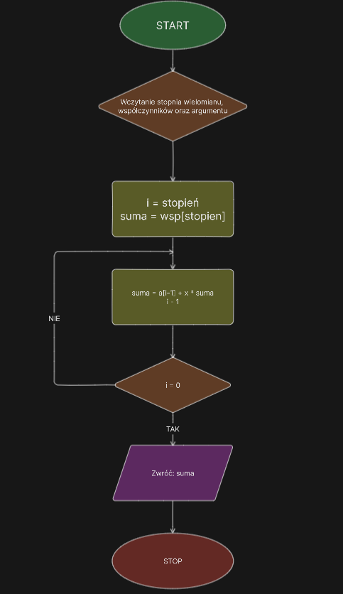
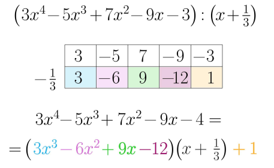

<style>
section.center > * {
  text-align: center;
}
</style>

<!-- _class: center -->

# Schemat Hornera 😎<br>(Horner Schema)

śpioch

---

## 🤯 Co to jest Schemat Hornera? 🤯

- Algorytm opiera się na faktoryzacji wielomianu, umożliwiając efektywne obliczenia.

* Algorytm Hornera to skuteczna metoda obliczania wartości wielomianu w punkcie, redukując liczbę niepotrzebnych operacji.

---

# Schemat blokowy



---

# Pseudokot 😺

```py
function horner(A, x)
    n = A.length - 1
    wynik = A[n]
    for i = n - 1 to 0
        wynik = wynik * x + A[i]
    return wynik
```

---

## Złożoność Obliczeniowa

- $O(n)$, gdzie $n$ to stopień wielomianu.

## Przykład zestawu danych:

- Wielomian stopnia $n$ z losowymi współczynnikami.

---

## Operacja Dominująca

- $Mnożenie$ i $dodawanie$ wewnątrz pętli Hornera są operacjami dominującymi.

---

## Zilustrowane działanie algorytmu



---
